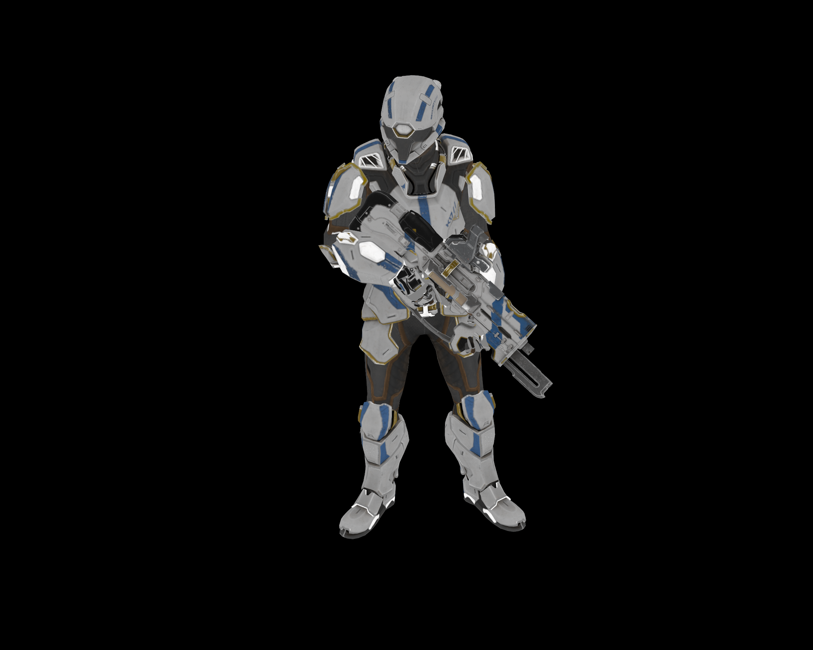

# Molasses' Vulkan Renderer
[](https://ko-fi.com/molasses)
[](https://www.patreon.com/molasseslover)

This is a Vulkan learning project I started, following the [Vulkan Tutorial](https://vulkan-tutorial.com/).
Currently, the project uses code roughly identical to the tutorial. By the
end of an ongoing rewrite, it will look nothing like this. I'm just testing out GLFW.
Many changes are coming, and have not yet been pushed to this repository,
in order to take care of legal information and credits.

It's also important to note that this is 100% a hobby project. It takes shortcuts,
uses other open-source projects as a crutch, and doesn't take itself that seriously.
I plan on making games with this renderer, but this isn't aiming to be the next
[BGFX](https://github.com/bkaradzic/bgfx) or [DiligentEngine](https://github.com/DiligentGraphics/DiligentEngine), by any means.

My end goal is to make a 3D rendering engine that targets 'mixed' lighting, which
is a combination of both statically baked, and realtime lightmaps. It is specifically
designed for newer hardware, and specs into quality moreso than raw performance.
If you plan on using this renderer in a project, keep in mind that this is likely
unsupported on older hardware.

I do not plan on using another graphics API like OpenGL or DirectX, either. 


> Model by [@fletcherkinnear](https://sketchfab.com/fletcherkinnear)

## Dependencies
> **Note**: The list of dependencies might be incomplete, sorry!

| Dependency | [pkgs.org](https://pkgs.org/)                                                                                                                                            | [brew.sh](https://brew.sh/)                                                                                                                                                                              |
|------------|--------------------------------------------------------------------------------------------------------------------------------------------------------------------------|----------------------------------------------------------------------------------------------------------------------------------------------------------------------------------------------------------|
| GLFW       | [](https://pkgs.org/search/?q=glfw)       | [](https://formulae.brew.sh/formula/glfw#default)           |
| Uncrustify | [](https://pkgs.org/search/?q=uncrustify) | [](https://formulae.brew.sh/formula/uncrustify#default)     |
| Vulkan     | [](https://pkgs.org/search/?q=vulkann)    | [](https://formulae.brew.sh/formula/vulkan-headers#default) |

## Building

From the project root directory, you can use CMake to build.

```sh
➜ cmake -B bin -DCMAKE_BUILD_TYPE=Release
➜ cmake --build bin -j$(nproc)
```

> **Note**: If you are unfamiliar with `$(nproc)`; it is a command that prints out
how many processing units are available. With the `-j` flag we tell CMake 
to create jobs equal to the number provided by `$(nproc)`. If you are on XNU/macOS,
 `$(nproc)` is not available. You should use `sysctl -n hw.physicalcpu` instead!

Once CMake finishes, the binaries should be available in the directory
equal to CMake's `-B` flag. In the case of the example commands, that should be
in the `bin` directory. 